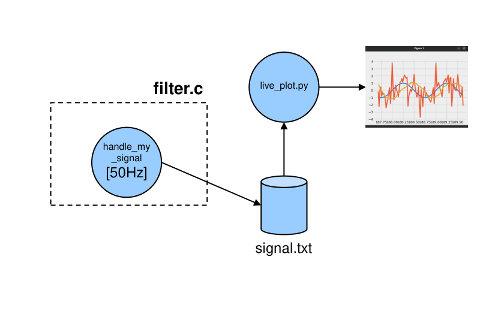
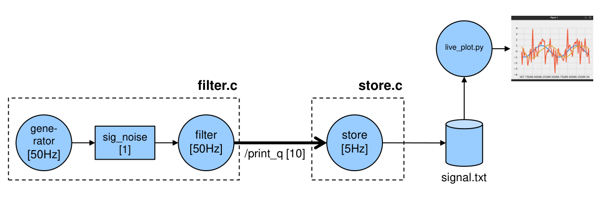
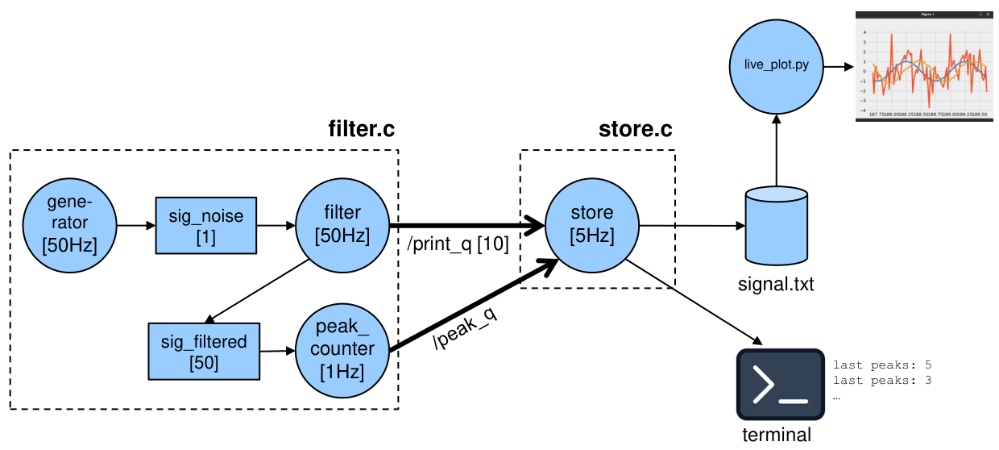
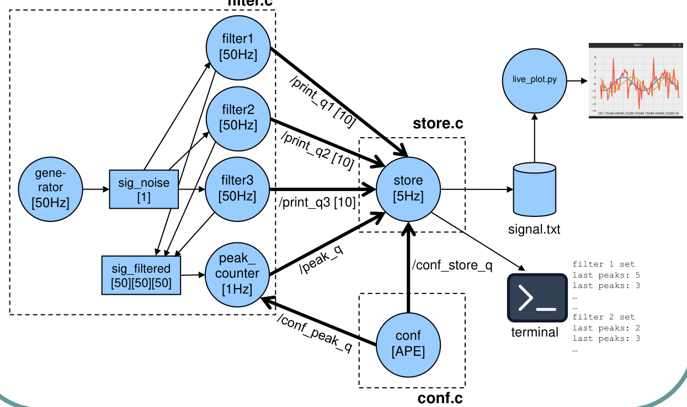

# Real-Time Filtering Pipeline (RT-POSIX)

This repository contains my solution for a real-time digital signal processing assignment.  
The goal is to implement a **real-time acquisition → filtering → logging → visualization** pipeline using **RT-POSIX** primitives (threads, message queues, synchronization) and **Rate Monotonic (RM)** scheduling.

---

## Background (Starter Code)
In the provided starter code, the first three stages (generation, filtering, storing) are merged into a single periodic timer handler, while visualization is performed by a Python script.

---

## Target Architecture

### Part 1 — Periodic tasks + IPC
The pipeline is restructured into three periodic tasks:

- **generator** (50 Hz) — produces a noisy sinusoidal signal  
- **filter** (50 Hz) — processes the latest sample  
- **store** (5 Hz) — writes filtered samples to `signal.txt`

Communication:
- `generator ↔ filter`: shared variable `sig_noise` protected by mutual exclusion
- `filter → store`: message queue `/print_q` (10 elements).  
  At each store period (5 Hz), `store` dequeues **10 samples** and appends them to `signal.txt`.

---

### Part 2 — Peak counter (1 Hz)
A fourth periodic task is added:

- **peak_counter** (1 Hz) — every cycle analyzes the **last 50 filtered samples** and counts local minima/maxima (“peaks”)

Communication:
- `filter ↔ peak_counter`: shared circular buffer `sig_filtered[50]` protected by mutual exclusion  
  (priority inversion must be avoided, e.g., using priority inheritance)
- `peak_counter → store`: message queue (e.g. `/peak_q`) sending the peak count  
  `store` prints it to terminal, e.g.:

  

---

### Part 3 — Multiple filters + aperiodic configuration
To compare filter performance, multiple filter tasks can run concurrently (example: 3 filters at 50 Hz):

- filter 1: moving average
- filter 2: 2nd-order Butterworth
- filter 3: optional custom filter

All filters write into a shared structure (e.g. `sig_filtered[filters][50]`) that must be protected as a whole with mutual exclusion (again avoiding priority inversion).

An additional **aperiodic** task:

- **conf** (aperiodic) — sends the index of the active filter to:
- `store` (via `/conf_store_q`) to select which print queue to read (default: `/print_q1`)
- `peak_counter` (via `/conf_peak_q`) to select which filtered buffer to analyze (default: filter 1)

---

## Scheduling Notes
- All periodic tasks are scheduled with **Rate Monotonic (RM)**.
- It is recommended to run all tasks on the **same CPU core** (CPU affinity or `taskset`) to keep timing predictable.
- A periodic thread helper library (e.g., “rt-lib” from course exercises) can simplify the implementation.

---

## Repository Structure
- `filter.c` — generator + filter task(s) + peak_counter (threads, shared buffers, synchronization)
- `store.c` — store task (thread, file logging, terminal output)
- `conf.c` — aperiodic configuration task (filter selection)
- `live_plot.py` — real-time visualization script (reads `signal.txt`)
- `signal.txt` — generated output (created at runtime)
